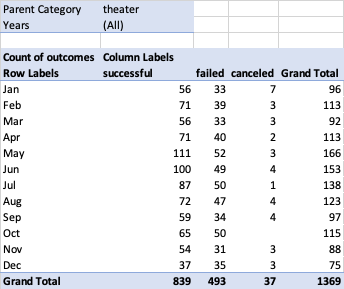
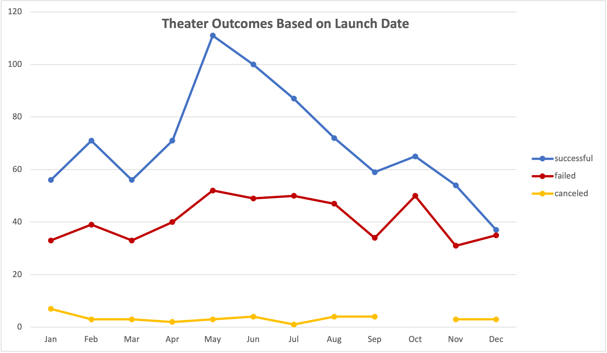
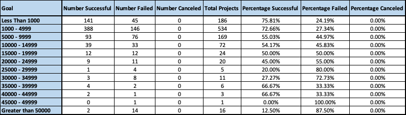
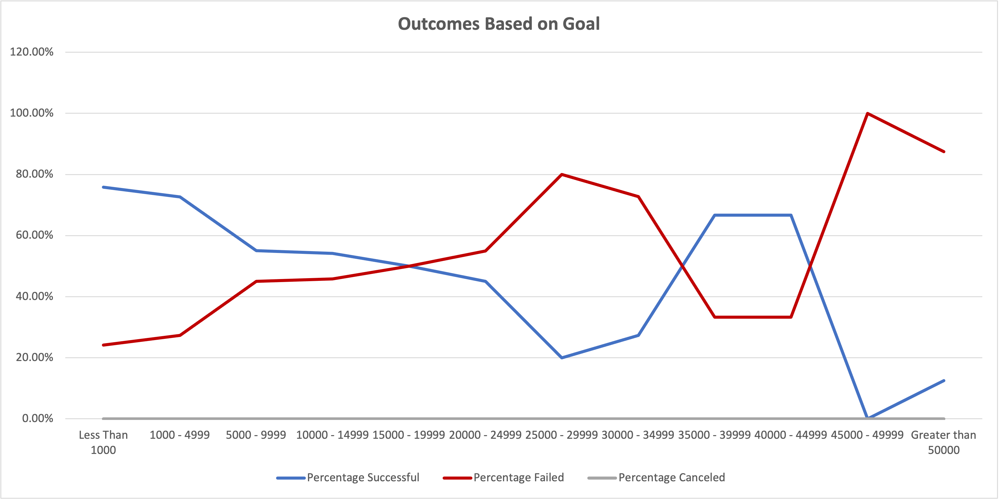

# Kickstarting with Excel

## Overview of Project
In this project, we were tasked with assisting Louise in setting and understanding how to create a successful kickstarter campaign for her play *Fever*.

### Purpose
At the start of this project, we were challenged to assist Louise in understanding how to create a successful fundraising campaign for her play *Fever*. To begin this project, we analyzed a dataset of Kickstarter campaigns across multiple countries and a variety of categories. This included categorical analysis to understand how theater kickstarter campaigns faired in the past, and descriptive analysis to understand the average goal and general spread of successful vs. failed campaigns. 

Once Louise launched her campaign, she came close to her fundraising goal in a short period of time. We are now tasked with helping her understand whether or not the time a campaign is launched or the overall goal amount changes the likelihood of the campaign succeeding.

## Analysis and Challenges
The analysis at this phase of the project was broken down into 2 parts - Launch Date Analysis and Fundraising Goal Analysis.

### Analysis of Outcomes Based on Launch Date
In order to conduct analysis based on Launch Date, a pivot table from the kickstarter analysis data was created.

 

In this table, we began to understand the general distribution of successful (839), failed (493), and canceled (37) theater campaigns. Moreover, we can see that the most populat months to launch a theater campaign were in the summer (May, June, July, August).

We then plotted the pivot table and created a line chart to get a better view of the data. In the below graph, it is clear that the most successful theater campaigns were launched in May and that October had an almost 1-1 ratio of successful-failed campaigns. Additionally, the number of canceled campaigns was low regardless of the month.

### Analysis of Outcomes Based on Goals
In order to conduct analysis based on fundraising Goals, a chart counting the success / failure / cancellation of the theater campaigns was created. Additionally, we calculated the percent of successful / failed / canceled campaigns to better understand the chance of success based on the dollar range of the campaign goal.

 

By looking at the percentage of successful campaigns, it is clear that campaigns under 5,000 are at least 70% likely to suceed.

Similarly to the launch date protocol, we then plotted the table and created a line chart to get a better view of the data. In the below chart, we can see that there are two ranges for success and two ranges for failure. It seems as though campaignes with goals under 5,000 or from 35,000-45,000 succeed at a rate of 66% and above. It also seems as though campaigns with a goal above 50,000 and between 25,000-35,000 are more likely to fail at a rate of at least 70% and above. 

### Challenges and Difficulties Encountered
One challenge that I encountered was structuing the "Countif" statements corrects in the analysis based on goals section. I wasnted to structure the formula so I could drag it across the "Number Successful", "Number Failed", and "Number Canceled" columns as well as down all of the goal ranges while changing as little as possible. 

With a few tweaks I was able to achieve this goal by using this format: 
=COUNTIFS(Kickstarter!$R:$R, "plays",Kickstarter!$F:$F, "successful", Kickstarter!$D:$D, ">=1000", Kickstarter!$D:$D, "<=4999")

This allowed me to drag the formula while only changing 2 items:
  1. succesful vs. failed vs. canceled
  2. goal ranges

## Results

- What are two conclusions you can draw about the Outcomes based on Launch Date?

  1. The most successful and popular months to launch a campaign are the summer months - May, June, July - but the most successful and popular month to launch a campaign is May with a success ratio of 66.87% and a total number of 166 campaigns. 
  2. The least successful and popular month to launch a campaign is december. There is only a 49.3% of success and there were only 75 campaigns launch. At 75 launch campaigns, it has 13 fewer launched campaigns than the next closest month of November (88 launches) and it has a success rate of 9% less than the next closest month of January (success rate of 58.33%).

- What can you conclude about the Outcomes based on Goals?

The most successful campaigns has a funraigsing goal of uner $5,000 or between 35,000-45,000. This seems to suggest that there are 2 distict markets that campaigns can target based on the needs of the play. The other goals are either more likely to fail or are not difinitively likely to succeed.

- What are some limitations of this dataset?

????

- What are some other possible tables and/or graphs that we could create?

  1. A pivot table for the Average donation for the subcategories under theater. This would show that the average donations were for successful, canceled, live, and failed campaigns. This would give similar data to the analysis based on fundraising goal, but it could also allow us to understand if the higher campaigns have many people giving a low number, or if there are truly 2 distinct categories of donations. (If the average successful campaign donation is 15,000 - we may be able to assume that there are at least 2 categories of donations becuase it is well above the overall successful campaign goal of under $5,000.)
  2. We could do a location analysis and create a bar chart for to better understand if a campaign would suceed based on location.
